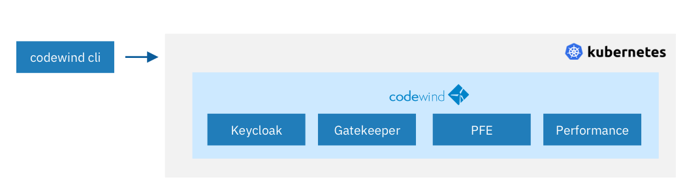
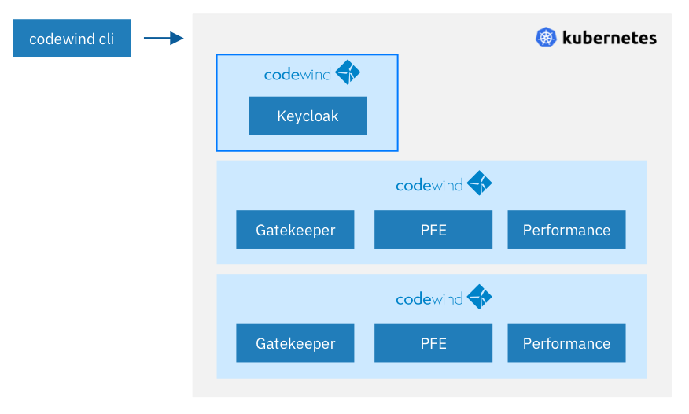
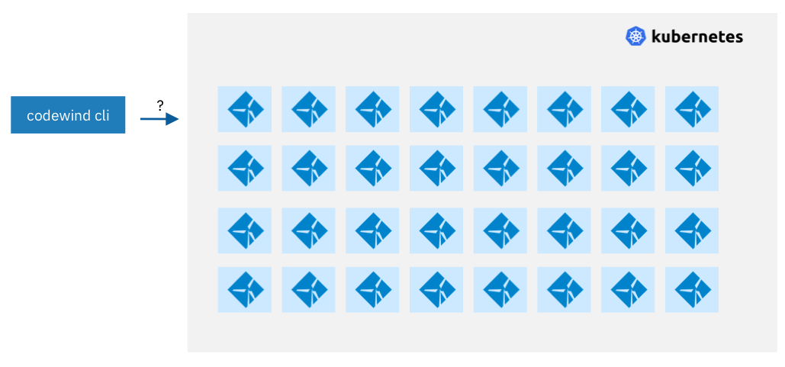
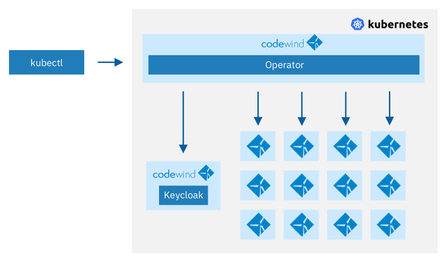
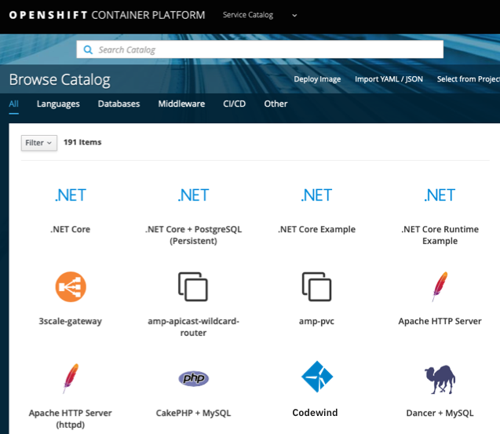

# The Codewind Operator

The Codewind-Operator is an evolution of Codewind remote deployment and attempts to remove some of the pain points and scalability barriers associated with deploying Codewind into Kubernetes for just one or multiple users.

## The problem

Previously setting up Codewind required logging into Kubernetes or Openshift and performing intricate steps to determine the cluster configuration before using the Codewind-CLI (cwctl).  The CWCTL command also had many subcommands and flags that were needed to install or remove Codewind or Keycloak.



Things get complicated to administer when adding additional Codewinds for users especially when they need to share a common Keycloak. The administrator needed to know the connectivity details for Keycloak or discover them using either the Openshift console or run kubectl commands with selectors before deploying each new Codewind.



Over time administration could gets unmanageble, the administrator carries the burden of deploying new Codewinds for users, connecting them up to Keycloak and providing the user with connectivity details. 




With the Codewind-Operator, this service handles the deployment and management of new PFE, Gatekeeper, Keycloak and Performance containers on behalf of a user. It has knowledge of all the Kubernetes resources that are part of a typical Codewind remote deployment, configures them and deploy each of the components on demand.

Deployment of the Codewind-Operator is performed using `oc` or `kubectl` with either a standard yaml or using Codewind CLI `cwctl`.  This step will require the human operator to have already logged into their Kubernetes or Openshift but that is only for the purpose of installing the operator.



Once installed, the Codewind-Operator runs in a pod on the cluster and can monitor the entire cluster or just a single namespace. The Codewind-Operator has the ability to deploy all the necessary Kubernetes resources to support Codewind including Pods, Secrets, PVC, Roles and Role Bindings and it can configure all of them including adding any security Realms, User Accounts (if they dont already exist), Access Roles, and exchange of any public keys.

## How it works

Codewind-Operator is built on the operator-sdk and monitors the state of the cluster. By monitoring what is currently running compared to what has been requested (eg set me up a new Codewind,  delete this specific Codewind), the Codewind-Operator has an ability to stand up new Codewinds or tear down running Codewinds or even launch support pods like "Codewind-Performance" on demand. With its knownledge of what makes up a Codewind instance it can remove PVC, Secrets and other supporting components. 

To achieve this, the Codewind-Operator adds two new custom resource definitions (CRD) for `Codewind` and `Keycloak`

Deploying a Keycloak service is carried out with a small piece of yaml code eg:

```
apiVersion: codewind-operator.eclipse.org/v1alpha1
kind: Keycloak
metadata:
  name: devex
spec:
  size: 1
```

This YAML requests creation of a new `Kind` of resource called `Keycloak` with the name `devex`. Thats it, the Codewind-Operator sees the request for the new Keycloak customer resouce, begins downloading the Docker image, creates the PVC, secrets and deploys a new Keycloak POD.

Follow-up commands such as:

`kubectl get pods` will show the new Keycloak pod as will `kubectl get keycloaks` which is a new command that understands the new `keycloaks` type.

## Deploying a new remote Codewind deployment

Similar to deploying a Keycloak service, deploying Codewind follows the same pattern:

```
apiVersion: codewind-operator.eclipse.org/v1alpha1
kind: Codewind
metadata:
  name: testuser1
spec:
  auth: devex
```

Deploying YAML like this will require authentication to the Kubernetes cluster.


The command `kubectl get codewinds` should display the list of running Codewind deployments:

```
NAME        AGE   AUTH    URL
testuser1   31m   devex   https://codewind-k5886ir3.mycluster-757441.eu-gb.containers.mydomain.cloud
testuser2   22m   devex   https://codewind-k5856a25.mycluster-757441.eu-gb.containers.mydomain.cloud
testuser3   7s    devex   https://codewind-k18364r5.mycluster-757441.eu-gb.containers.mydomain.cloud
```

Running the command `kubectl get keycloaks` will show the Keycloak details`.

```
NAME        AGE   URL
devex       42m   https://codewind-keycloak-k18465r6.mycluster-757441.eu-gb.containers.mydomain.cloud
```

Deleting instances:
```
$ kubectl delete codewinds testuser3 testuser2
codewind.eclipse.org "testuser3" deleted
codewind.eclipse.org "testuser2" deleted
```

Operator logs :
```
{"level":"info","ts":1579097561.492997,"logger":"controller_codewind","msg":"Reconciling Codewind","Request.Namespace":"default","Request.Name":"testuser3"}
{"level":"info","ts":1579097561.5555182,"logger":"controller_codewind","msg":"Reconciling Codewind","Request.Namespace":"default","Request.Name":"testuser2"}
```


## Requesting a Codewind deployment without a Kube context

A Codewind user may not have access to use `oc` or `kubectl` commands against the cluster and would not be able to talk to the Codewind-Operator via the Kube API as shown above.

Instead, assuming the operator has already been installed and a user account created in Keycloak, the new user can request the operator generate a new Codewind remote instance.

This action is then handled by the operator where it carries out the exact same steps to deploy the Codewind instance and configure the Keycloak service with required access roles to the new containers. This is carried out using the service account of the operator rather than a login account.

Once the Codewind service has been deployed, the URL of the instance is displayed ready for the user to copy into their IDE when creating a new connection.

## Where to find the Codewind-Operator

Ideally, the operator should be easy to find, for example on Operator hub or on the application catalog of Openshift:



