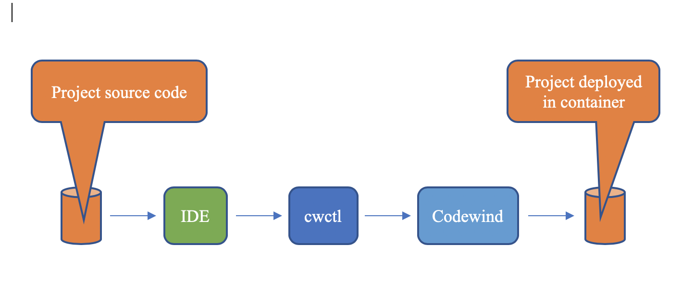
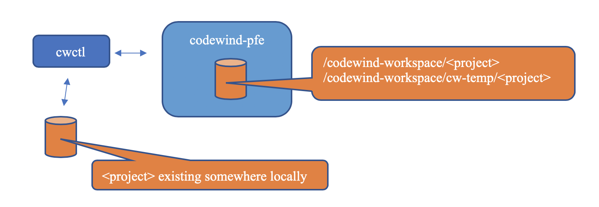
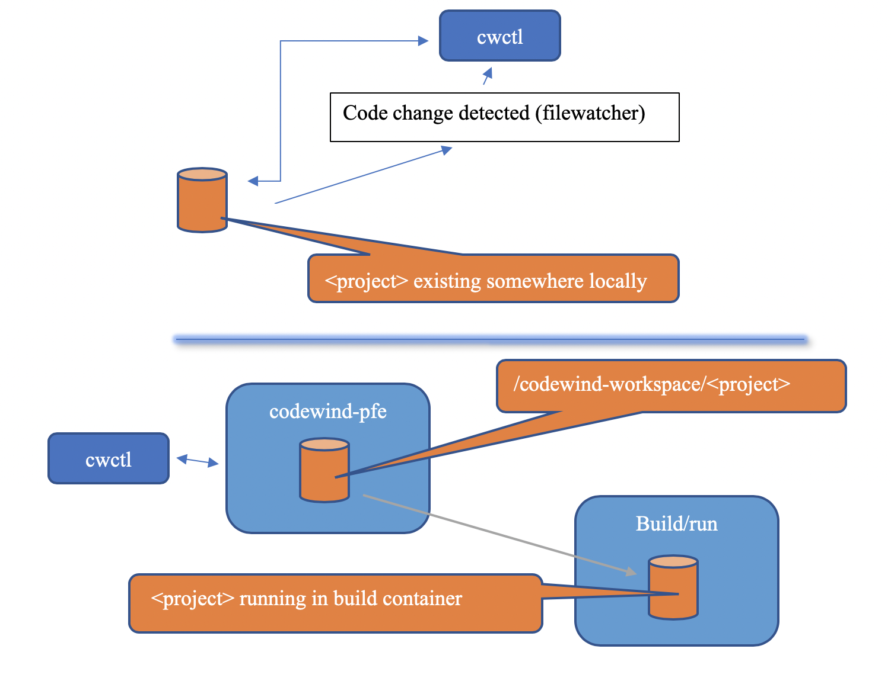

# Codewind Server Design Documentation

The Codewind server consists of two main elements. These are the API frontend (portal), and the build and run engine (turbine) .

## Flow of project data

A user's project data typically flows in one direction when using Codewind.

1. Project starts on disk
2. It's edited in an IDE
3. The Codewind IDE plugin in turn communicates with cwctl (the Codewind CLI).
4. cwctl sends files to the Codewind server
5. The project gets built and deployed in a container



## Adding a project to Codewind

For a project to be added to Codewind (using cwctl bind), it must already exist either locally on disk or, in the case of fully-hosted, in a volume associated with the IDE.

### Steps for user of cwctl

To download a project from a template, and initialize it as a Codewind project (detecting its type and adding a `.cw-settings` file)

```shell
cwctl project create -p <disk location to download project> -u <url of project template>
```

To initialize an existing local dir as a Codewind project.

Note: the connection ID is optional, but is required if PFE is only deployed remotely. Without a connection ID, cwctl will default to calling the local PFE.

```shell
cwctl project validate -p <disk location of project> --conid <connection ID of remote PFE>
```

To then bind a project to Codewind

```shell
cwctl project bind -p <project location on disk> -l <language> -t <type> -n <project name> --conid <The connection ID for the project (default "local")>
```

Response of Project ID and Status

`Project ID:/ 1db976c0-0475-11ea-a25d-c143077130ce/Status:/ 200 OK`

### Internal flow

All actions that require access to the local filesystem will be done by cwctl rather than a bind mount back from the Codewind PFE container.
This removes any issues with permissions and the need to have the local workspace running as a container.

1. cwctl calls `/api/v1/projects/bind/start` api on PFE

2. This API creates the project's directory structure in the Codewind PFE volume under `codewind-workspace/<projectname>`

3. cwctl makes one call per file to `/api/v1/projects/:id/upload` on Codewind PFE for every file in the project

4. `/api/v1/projects/:id/upload` receives each file and then writes it to `/codewind-workspace/cw-temp/<projectname>`

5. cwctl calls `/api/v1/projects/:id/bind/end`when all files have been copied

6. `/api/v1/projects/:id/bind/end` copies project from `codewind-workspace/cw-temp/<projectname>` to`codewind-workspace/<projectname>` and then notifies Turbine that a new project is ready to build and run



## How does a delta code change work?

If a user makes a code change, upon saving that file, Codewind should automatically build and run the application with that code change

The cli needs to be told when the local project is ready to be uploaded to the codewind-pfe container.
For example, by the file watcher daemon when it detects a code change

### Steps for user of cwctl creating a project

cwctl called to sync changed files to codewind-pfe container

```shell
cwctl project sync -p <absolute path to project> -i <projectID> -t <milliseconds since epoch of last sync call>
```

### Internal flow when creating a project

1. cwctl calls `/api/v1/projects/:id/upload` once for every file that has changed.
   The list of files is worked out by comparing the last modification time of each file in the project against the passed in '-t' parameter.
   Any file with a newer time is uploaded. The file must be in the watch list.
   Each file that is uploaded is written to `/codewind-workspace/cw-temp/<projectname>`

2. cwctl calls `/api/v1/projects/:id/upload/end`

3. If a build is not in progress, changed files get copied to the build/run container created by turbine.
   A notification of changed files is also sent to turbine which will trigger a rebuild.
   If a build is already in progress, the copy to build container will wait until the build finishes



## Upgrading to Codewind Version 0.6.0

For 0.6.0, the restriction for having to have all user projects in a `codewind-workspace` has been removed.
This means that projects created before 0.6.0 will need to be upgraded to the latest version.

### Steps for user of cwctl syncing a project

cwctl called to upgrade projects that were created in a previous release

```bash
cwctl upgrade --workspace <old codewind-workspace dir>
```

### Internal flow when syncing a project

1. cwctl will parse the passed in workspace looking for the project.inf files associated with a project

2. For each project.inf found, cwctl will bind that project to codewind
   (see Adding a project to codewind)

## User want to remove a project from codewind

A user need to be able to remove a project from codewind if they no longer want to use it

### Steps for user of cwctl removing a project

Currently, cwctl is not required to remove a project.

### Steps for users of api removing a project

`/api/v1/projects/:id/unbind` needs to be called on Codewind PFE.

### Internal flow when removing a project

Projects are not actually deleted by codewind. The underlying source code will still exist in the workspace. The Codewind IDE plugins give the option to delete the local source code when deleting a project.

Calling `/api/v1/projects/:id/unbind` will

- stop all the logs streaming
- inform turbine to delete the project \* remove project from `/codewind-workspace/<projectname>`
