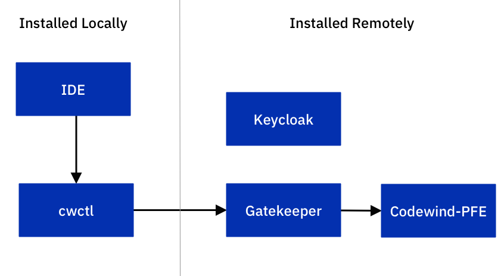

# Security

A high level view of the major parts of Codewind when running
with a remote installation on Kubernetes. 

When running in remote mode, a user is able to use their desktop installed IDE (with source code locally) and use the Codewind remote services to build and run their projects in a remote cloud.

Cloud services are secured using a gatekeeper container which exposes an Ingress route that proxies the connection through to the Codewind PFE service.




## Socket encryption

When Codewind is configured to run in Remote mode,  all connections to Gatekeeper, PFE and Keycloak use HTTPs.  This is essential in order to protect security tokens and passwords from being intercepted in transit.

## Codewind Gatekeeper

The role of the Gatekeeper container is to marshal the requests from the local environment through to the Codewind Cloud service. By acting as a reverse proxy, Gatekeeper ensures Codewind PFE bound traffic is accompanied with a valid authentication bearer token.

The exception to this are UI Socket connections which are allowed to tunnel through to the Gatekeeper proxy and terminate directly in the PFE container. For these connections  token validation is handled by PFE directly during a socket connection handshake.

At deployment time, Gatekeeper is configured with the necessary secrets and connectivity details of the Codewind Keycloak service. More details on deploying codewind are available [here](./Deploying&#32;codewind.md)

## Codewind Keycloak

User authentication services and identity management are provided by Keycloak. Gatekeeper and Keycloak go hand in hand with a single installation of Codewind containing Codewind PFE and Codewind Gatekeeper and Codewind Keycloak.

Installing Keycloak is achieved using cwctl (see [here](./Deploying&#32;codewind.md)

Beyond its simplest form of installation, Keycloak can be installed in its own namespace and shared between multiple Codewind Remote deployments. Obvious advantages to this approach include:

* fewer deployments or pods to manage
* a single security realm for all Codewind deployments (a realm is a collection of users and clients)
* role based access control that link users to Codewind deployments
* If and organization already has Keycloak (for example they are using CHE) Codewind can be configured to use that service

The main concepts of Keycloak are :

* Realms - A top level grouping
* Clients - A service that is allowed to make use of Keycloak authentication services
* Users - User records, user names, user passwords
* Roles - Access roles that allow users with a specific role to access a Codewind service filtering users by role name

## Codewind CLI (cwctl)

The Codewind CLI has an important role to play as part of a Codewind deployment.

cwctl provides commands to :

1. Deploy Keycloak service :   `cwctl deploy keycloak`
2. Deploy Codewind :   `cwctl deploy remote`
3. Manage client side connections to a remote deployment `cwctl connections`
4. Manage storage of user credentials to the platform keychains `cwctl seckeyring`
5. Handle authentication and access token requests `cwctl sectoken`

## Authentication Flow

Before a user can access Codewind remote services they are required to authenticate. In most cases they will use the IDE to create their connections to a remote deployment, add authentication credentials and authenticate however since the IDEs use the cwctl cli directly to achieve this, below is a summary of steps necessary to retrieve an access token which can be used by curl to query one of the Codewind APIs.


## Create a new connection

A connection is all the meta data necessary for CWCTL to identify a Codewind remote instance. It is stored locally on the users workstation in their home directory under the path ~/.codewind/config/connections.json

On first use of Codewind CWCTL a brand new connections.json file will created containing reference to a 'local' deployment :

```
{
    "schemaversion": 1,
    "connections": [
        {
            "id": "local",
            "label": "Codewind local connection",
            "url": "",
            "auth": "",
            "realm": "",
            "clientid": "",
            "username": ""
        }
    ]
}
```

Remote connections will be added to this list using the command `cwctl connections add` more details on this command available [here](./Deploying&#32;codewind.md)

Adding a connection to a remote server :

```
cwctl --insecure connections add --url https://codewind-gatekeeper-k3rdhvxk.10.99.117.86.nip.io --label myremote --username developer
INFO[0000] Connection K3RETDJR added successfully
```

Note:

* --insecure is used to turn off certificate checking
* --url should point to the GATEKEEPER URL not the KEYCLOAK URL 
* --label is an identifying label that the IDEs will use to sort the connection list
* --username is username of the person (registered in keycloak) which will be using this connection


