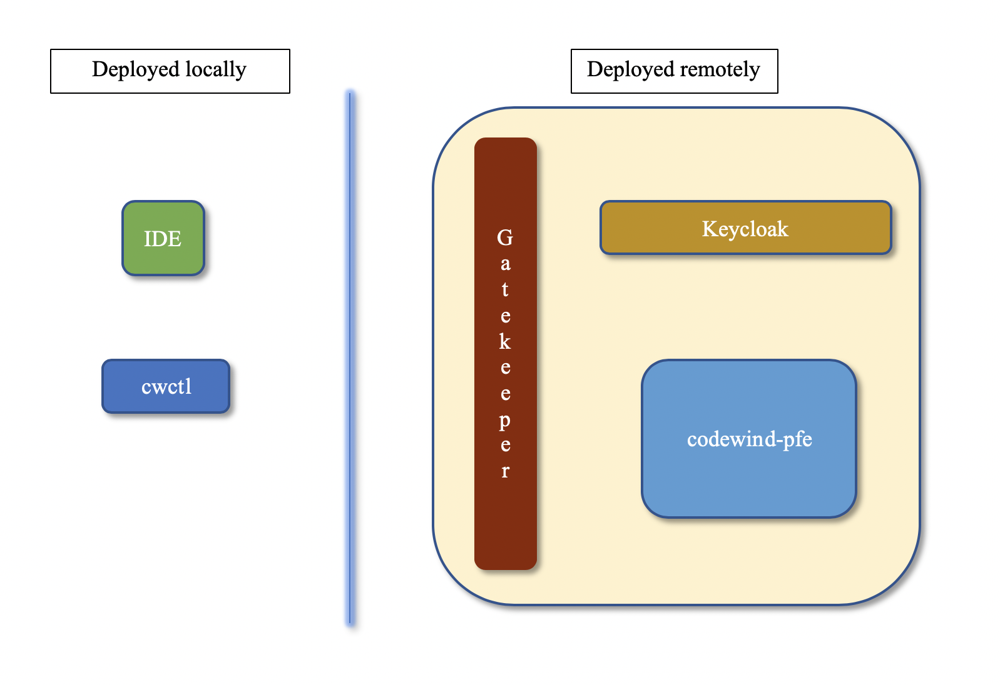

# Security
Below is a high level view of the major parts of codewind when running
with a remote installation of codewind-pfe. This would allow a user to
develop an application on their desktop (with source code locally) but
build and run it on a remote cloud. When running, the gatekeeper service
will provide the ingress endpoint that will be used for all
communication to pfe.

