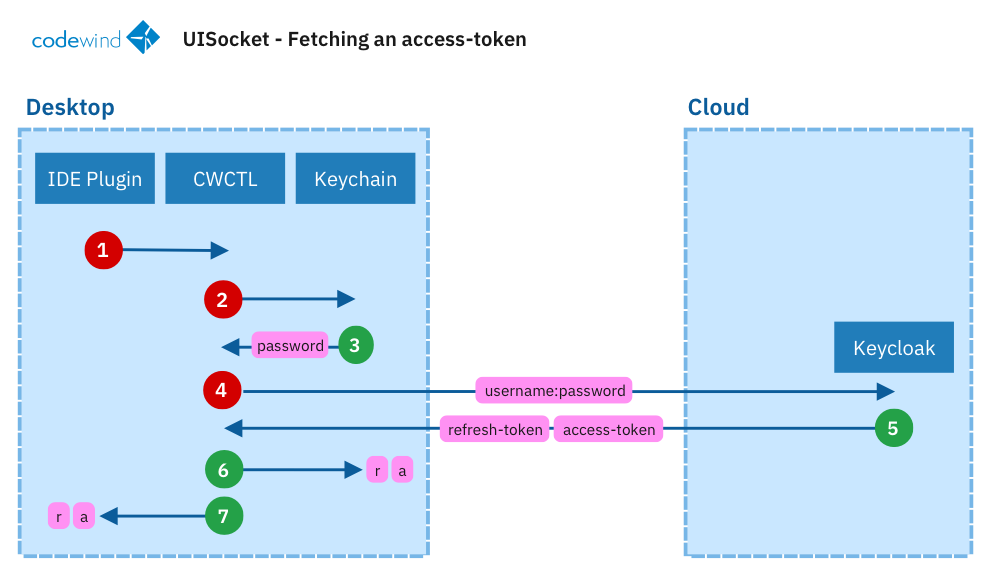
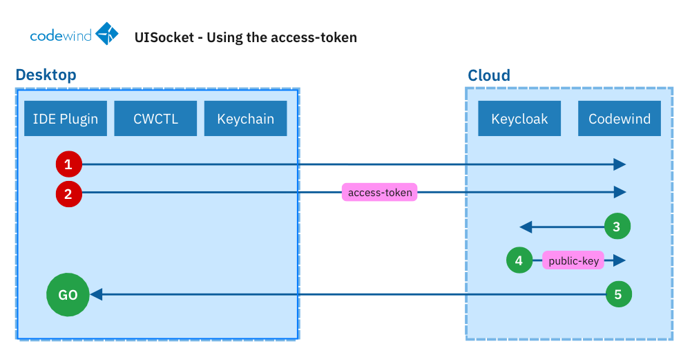
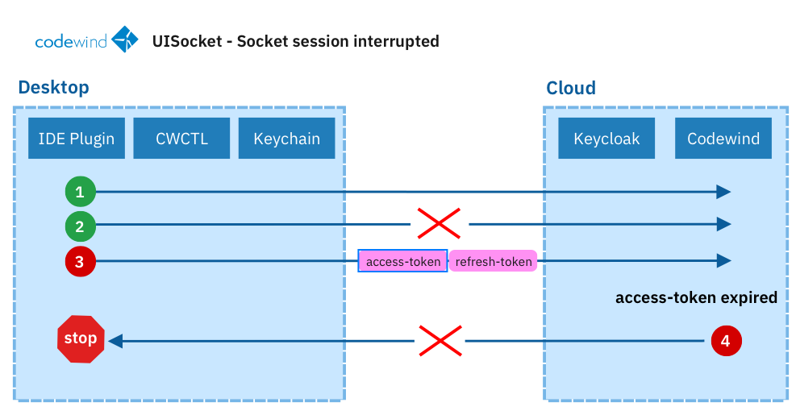

# SocketIO authentication

When Codewind is running as a remote deployment, its UISocket is protected from unauthorised access. IDEs must complete an authentication handshake before data and socket events can begin streaming. Authentication is achieved using an access token. 

This document outlines the flow:

## Part 1 - Requesting an access token

1. IDE makes a request to CWCTL to ask for an access_token.  It does this by calling the `cwctl sectoken get` command and supplying a connection ID.
2. Codewind CLI (cwctl) looks up the user in the platform keychain for the desired connection.
3. The exepected result is a password secret read. At this point,  the cwctl knows the users password but has not authenticated yet. 
4. CWCTL  looks up the ~/.codewind/config/connection.json and gathers the auth address of keycloak, realm and clientid details.  Cwctl then uses those elements to ask Keycloak for authentication tokens.
5. Keycloak validates the credentials, realm, clientID and generates both an access-token and a refresh-token sending them back to the CLI.
6. cwctl saves a copy of the refresh_token and access-token in the platform keychain
7. cwctl returns the access-token and refresh-token to the IDE.

## Part 2 - Using the access-token

Now that the IDE has a valid refresh token,  the next step is for the IDE to connect to Codewinds UISocket.

1. IDE makes a socket connection request to Codewind
2. As soon as the socket is connected, the IDE must emit an authentication event with the access-token as a payload.  This access-token should be the one it `just` received from cwctl in section 1 above.
3. Codewind hears the emit event and fetches the public key of the codewind-client from the Keycloak service it is paired with.
4. Assuming the client is found in the registered realm, Keycloak responds with the public-key.
5. Codewind checks the access-token using the client public-key and also that the token has not expired.
6. Assuming everything is valid the connection is considered "authenticated" and messages can begin streaming in both directions.

## Part 3 - When an established socket disconnects

Socket connections remain active through the life of the connection. Access tokens on SocketIO connections do not require refreshing until the connection is lost. This diagram shows the flow starting from the point where the socket is authenticated and established. 

1.  Socket is established, IDE is able to stream socket events.
2.  The socket connection drops (for whatever reason)

At this point the flow should be to start from PART 1 above. If the previously retrieved access token or refresh token is presented to Codewind the connection will still fail.

3. IDE tries to send the original access-token and refresh-token.
4. Codewind repeats the validation step but determins the access-token has expired. SocketIO does not care about the refresh token.
5. Since the token is invalid the socket connection remains unauthenticated and blocked.

## Refresh vs Access tokens

* access-tokens expire before refresh-tokens
* refresh-tokens are only to be used to request access-tokens
* Codewind API and socket connections requests should bundle access-tokens not refresh-tokens

