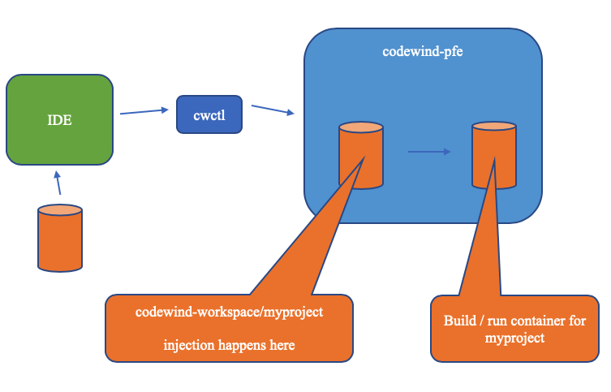

Injecting metrics at build time
===============================

Not all projects will have the required packages needed to provide
monitoring. We have added the ability to auto inject the required
configuration at build time to include these packages. The user will
need to opt in for this to happen as we will be modifying the source
code (but only in the build container)

Steps for user of cwctl

1.  *Currently, cwctl is not required to inject metrics*

Steps for users of api

1.  */api/v1/projects/\<id\>/metrics/inject* with a body of {enable :
    boolean} needs to be called

Internal flow

If metrics injection is set on a project, the source code is modified in
codewind-workspace/myproject prior to being built. This is done on a per
project basis.

We save a copy of any files that are modified as a result of adding
metrics (pom.xml, package.json etc). If the injection is turned off, the
files can be reverted to their original state from these copies. This
check and injection happens each time code is synced to pfe

