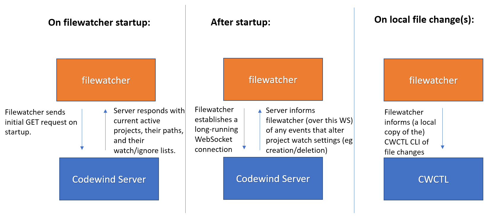

# A file monitoring component for Codewind Eclipse/Codewind VS Code/Codewind on Che/Theia/Standalone that monitors for source code changes

References to Microclimate in this document refer to the predecessor project to Codewind, [Microclimate](microclimate.dev/). 

## Codewind File Monitoring Requirements

Codewind requires the ability to monitor Codewind-managed project directories for file changes, such as source code or `build.xml` file changes. These file changes are used to (indirectly) inform the Codewind server when a build should take place. 

This requirement is consistent with the work previously done by *microclimate-beacon* and *project-watcher* in Microclimate. However, with Microclimate, all file monitoring was done from INSIDE Docker containers. Unfortunately, we discovered that this is unreliable on Windows, where Docker for Windows cannot detect file changes from within a Docker container (as of this writing). 

Therefore we need a mechanism that runs OUTSIDE of Docker in order to detect file changes to Codewind-managed projects. We also require the ability to communicate changes from the Che/Theia sidecar, to Codewind.

This mechanism will be part of the local IDE for most cases (or in the case of Che/Theia, in a separate sidecar container). In the future we may add support for a truely standalone daemon, so we should not make any design decisions that preclude us from adding this in the future.

## File monitoring is the responsibility of Eclipse/VS Code IDE plugins in the local case, and a standalone filewatcherd executable in the Theia on Che/CLI cases

To meet these requirements, we delegate file monitoring to the following components, in the following scenarios:
- **Local: Supported IDE, local Codewind Server (Eclipse/VS Code)**
  - Eclipse: Codewind Eclipse uses the Eclipse-native file monitoring mechanism to detect file changes. For files the exist outside of the Eclipse workspace, it will use the platforms respective file change abstractions (Java has java.nio.file.WatchService, Node.js has fs.watch)
  - VS Code: The platform's respective file change abstractions (Node.js has fs.watch, which the filewatcher consumes via chokidar)
- **Theia on Che, on Kube**
	- A new daemon, filewatcherd, is started by the Codewind Che/Theia sidecar. This is implemented in Go and uses the platform's respective file change abstraction (fsnotify)


File monitoring will be implemented inside the supported IDEs (in Java for Eclipse, and in Node/Typescript for VS Code). They function the same as the filewatcherd component, but are instead implemented using the native language and APIs of the host platform (Eclipse/VS Code). All of the filewatchers are long-running components that have a lifecycle equivalent to the Codewind Server.

## File monitoring design for Eclipse, VS Code, and standalone filewatcherd

From here on in the document, I will refer to all 3 components (Eclipse/VS Code/standalone filewatcher) as "filewatchers". The expected behaviour and expected client API will be the same between the three. 

The behaviour of filewatchers differs from the old behaviour of the *microclimate-beacon* and the *project-watcher* components of Microclimate. With Microclimate, complex standalone scripts would monitor Microclimate projects and make many decisions around when builds should be run. For example, if `project-watcher.sh` detected a `.java` file change, it would curl the internal filewatcher API to start a build for that project. This worked, but had the disadvantage of splitting the build logic between two separate components (bash scripts in the container, and the filewatcher typescript container logic), which was difficult to debug/maintain.

In contrast, the filewatchers described here are as simple as possible, and they do not prescribe a particular behaviour (eg build). With this design, filewatchers recursively watch a project directory, and for any files/directories that change (and that change is not filtered out by the ignore list), the filewatchers (indirectly, via cwctl) send a list of every visible file change to Codewind Server. 

This has the advantage of moving the decision to build out of the file monitoring logic, and into CWCTL and the Codewind Server (where the actual server build logic is located). The Filewatchers communicate file changes to CWCTL/Codewind Server, and CWCTL/Codewind Server decide when/if to build. Unlike the old design, the filewatchers do not decide when to build (and this allows us to reduce their complexity and centralize logic)

Filewatchers know what to watch, because they will connect to Codewind Server on a new API, and listen for project creation/deletion events.



Note: Why not just send a doBuild request to the Codewind Server, like we did with Microclimate, rather than calling `cwctl project sync`?
- Centralize knowledge of project details within the server and cwctl
	- For example: if we change what file extensions we care about from one release to the next, then we need to update that in multiple codebases (both filewatcherd and elsewhere).
- Since the server is receiving all file change events, it is easier to debug on the server-side why a build started 
- filewatcherd does not need to know the project type, or what file resources matter
	- Since filewatcherd can stay "dumb", it means it is less error prone, and easier to maintain.

## New Codewind Server Server APIs:

- **GET** `(Codewind Server URL)/api/v1/projects/watchlist` - Filewatchers use this API to determine which directories to watch, and which files/directories to ignore.
- **PUT** `(Codewind Server URL)/api/v1/projects/{project id}/file-changes/(projectWatchStateId)/status?clientUuid=(...)` - Filewatchers use this to inform Codewind Server of watch success/failure.
- **WebSocket Endpoint**  `(Codewind Server URL)/websockets/file-changes/v1` - Filewatchers connect on this API, in order to be informed of project deletion/creation (and the project watch changes will be mentioned in here).

See below for descriptions of how each API is used.


## Filewatchers: Client side inotify event processing algorithm:

*Summary*: After at least one file-change event is received, wait for there to be no more events in the stream of inotify events (within some X msecs, eg 500) before sending them to the server. Batch together events seen since within a configurable timeframe.

Initial state:
- `List<String>` paths received, initialized as an empty list
- Timer timer = null

1) On file change 'Event e' received:
	- if (e is for a file that is on our file/directory ignore list) {  return; }

2) Valid 'Event e' received from step 1:
	- add it to pathsReceived
	- if (timer == null) { timer = new timer(); timer to go off 100 msecs from now } 
	- else if (timer != null) {  reset timer to go off 100 msecs from now }

3) On timer expiry:
	- List<String> pathsToSendToServer = pathsReceived.removeAll();
	- timer = null;
	- Convert pathsToSendToServer to json, compress that, then base64 for the result, send to server along with current timestamp

Example:
- Event 1 received at 10 msecs (absolute time)
- Event 2 received at 30 msecs 
- Event 3 received at 80 msecs
- No additional events seen at 180 msecs.
- In this scenario, these 3 events would be grouped together and sent at 180 msecs.


## How do filewatchers know what to watch for?

On first connecting to a Codewind server, filewatchers will send a GET request to Codewind Server: `GET (Codewind Server url)/api/v1/projects/watchlist`
  - body of the response will contain list of projects and what directories/files to ignore in each one

The watchlist body will look like this:
```json
{
   "projects":[
      {
         "projectId":"(uuid project id from server)",
         "pathToMonitor":"/C/Codewind-1907/Codewind-workspace/myproject",
         "ignoredPaths":[
            "/target/*"
         ],
         "ignoredFilenames":[
            "*.class"
         ], 
	       "projectWatchStateId" : "[...]",
         "projectCreationTime" : 0,
         "refPaths" : [{
            "from" : "absolute path",
            "to" : "project relative path"
         }],
      },
   ]
}
```

Filters are case-sensitive, and all paths/directories specified in all request/response bodies should use `/` as the path separator (UNIX-style), rather than \ (Windows-style), independent of the platform this is run on.

`pathToMonitor`:
- `pathToMonitor` **MUST** be an absolute path of the host machine, and not a path inside the container. This is required due to new "root-less" model of Codewind projects.
- `pathToMonitor` should always begin with a `/` and should never end with a `/`. 
- On Windows, drive letters should be expressed like so: if the path is `c:\users\administrator\my-Codewind-project`, it should appear in the JSON as `/c/users/administrator/my-Codewind-project`.

The `ignoredPaths` are *relative paths* from the project's root dir, with `/` as the project root. So, for example, if you wanted to ignore the target directory of a Maven project, you would use `/target/*`, *not* `target/*` nor `/home/jgw/Codewind-workspace/project/target/*`.

`ignoredPaths`:
- Each ignored path is a string (with support for `*` wildcard) which is applied to the *relative path* of a changd files. 
  - Example: if a `com.jgw.MyClass` java file changed, then the path would be `/src/com/jgw/MyClass.java`, and the following `ignoredPath` would filter it out: `*src*com*.java`.

`ignoredFilenames`:
- Each ignoredFilename  is a string (with support for `*` wildcard) which is applied to *only the filename* of file or directory. It is not applied to the file's path.
  - Example, if the `com.jgw.MyClass` java file changed, then the path would be `/src/com/jgw/MyClass.java`
  - a `*.java` filter would filter it out
  - a `*src*.java` filter would NOT filter it out, because src is part of the path and not the filename.
  - a `com` filter WOULD filter it out, because `com` would match on the filename of a parent directory in the file path (/src/**com**/jgw/MyClass.java).

`refPaths`:
- The `refPaths` field was added [as part of this feature](https://github.com/eclipse/codewind/issues/1399), which allows the user to synchronize custom files from outside the container (and outside the project root) into the container at specified point.

`projectCreationTime`:
- The `projectCreationTime` field was added to help fix [these](https://github.com/eclipse/codewind/issues/1039) [bugs](https://github.com/eclipse/codewind/issues/1471). If this value is non-zero when the filewatcher first received this field, it will pass this value as the timestamp to cwctl. See description on 1471 for more details.

`projectWatchState`:
- See description in dedicated section below.

After startup, filewatchers should establish a long-running WebSocket connection to `(Codewind Server URL)/websockets/file-changes/v1/`. On this WebSocket connection, Codewind Server will inform filewatchers if any new projects are created, or any existing projects are deleted (which means the watches need to be updated).
- The following JSON message would be sent to all filewatchers, by the Codewind Server, whenever a project is created/deleted/watch changed. `projects` has the same format as the watchlist body: 
```json
{
  "type": "watchChanged",
  "projects": [
    {
      "changeType" : "add/update", 
      "projectId": "(uuid project id from server)",
      "pathToMonitor": "/C/Codewind-1907/Codewind-workspace/myproject",
      "ignoredPaths": "[ ... ]",
      "ignoredFilenames": "[ ... ]",
      "projectWatchStateId" : "[...]",
      "projectCreationTime" : 0,
      "refPaths" : [{ "[...]" }],
    },
    {
      "changeType" : "delete", 
      "projectId": "(another uuid project id from server)",
    }
  ]
}
```


## The `projectWatchStateId` field for reporting file monitoring errors to Codewind server

Every project managed by Codewind server will have a  `projectWatchStateId` value. This value will be initialized to either an arbitrary initial value (either a counter starting at 0, or a random UUID.) Each project should be initialized to a different unique value, and the IDs should be globally unique (it's up to implementors, but I would just suggest using a UUID and not worry about setting up a counter.)

Whenever the project watch list is provided to file watcher (either through the GET request or through the WebSocket, both described in the link above), the `projectWatchStateId` field will also be included in the list JSON boy. You can see this in the JSON above.

This `projectWatchStateId` must be updated when the watch list of an existing project changes:
- An item is added/removed from `ignoredPaths`
- An item is added/removed from `ignoredFilenames`
- (In no other cases should the `projectWatchStateId` change)

So when one of the above changes is made, the `projectWatchStateId` must be updated, for example, setting it to a new random UUID.  Any future file monitoring response bodies will thus include this new value.

#### How is this value used?

It will only be used when the file monitoring daemon wants to report an error with a specific set of watch values.

When the filewatcher detects an error with the watch values (for example, it is asked to watch a directory that doesn't exist), it will take the `projectWatchStateId` of the failing watch, and call this API:

`PUT /api/v1/projects/{project id}/file-changes/(projectWatchStateId)/status?clientUuid=(...)`

With PUT Request Body: `{ success: "boolean: either true or false " }`

With Codewind server responding with `200` in all cases.

For example, if the projectWatchStateId is `d629246a-ad01-4634-be97-42221450e49f` for the JSON above, and for some reason we aren't able to listen on `/C/Codewind-1907`, then we will send a PUT to:
`PUT /api/v1/projects/191911/file-changes/d629246a-ad01-4634-be97-42221450e49f/status?clientUuid=(...)`


#### What does Codewind server do with this PUT request?

Codewind server should compare the `projectWatchStateId` value from the URL above, with the current value of `projectWatchStateId` for the given project. 

If they match:
- Then the monitoring daemon is pointing out an error with the current watch value, and the error should be passed to the IDE/user.

If they don't match:
- Then the monitoring daemon is reporting an error  with an OLD watch; for example, imagine if the user makes 2 changes in quick sucession. We want to only display an error for the MOST RECENT watch. There's no point in letting the user know that an old watch didn't work.
- So in this case, after Codewind server compares the values and finds that they don't match, Codewind server just accepts and ignores the HTTP request (does not pass it to the user).


#### `projectWatchStateId` Conclusion

So this should be a straightforward way for both Codewind server and the file monitoring daemon to detect and communicate issues with specific watches. 
Codewind server only needs to store a new project-specific value (and make sure it is updated on watch change), and the file monitoring code only needs to pass this value back on a simpe new POST API.


## Why have both `ignoredPaths` and `ignoredFilenames`?

`ignoredFilenames` give you additional flexibility that you can not get from `ignorePaths` alone. Here is a scenario that shows that `ignoredFilenames` is not a functional subset of `ignoredPaths`, and in fact you can't create an equivalent path filter for this filename filter.

#### Paths in a project:
```
/dir/onetwothreefourfive
/dir/two/five
```

(`dir` and `two` are directories, everything else is a file)

#### Filename filter: `*two*five*` (eg filter out files whose file names contains the word two, followed by the word five)

I am looking for a path filter that will have the same behaviour as the above filename filter, with the above paths.

#### path-filter: `*two*five*`
- Will incorrectly match `/dir/two/five`, which the original filter did not

#### path-filter: `/*two*five*`
- Will incorrectly match `/dir/two/five`, which the original filter did not
